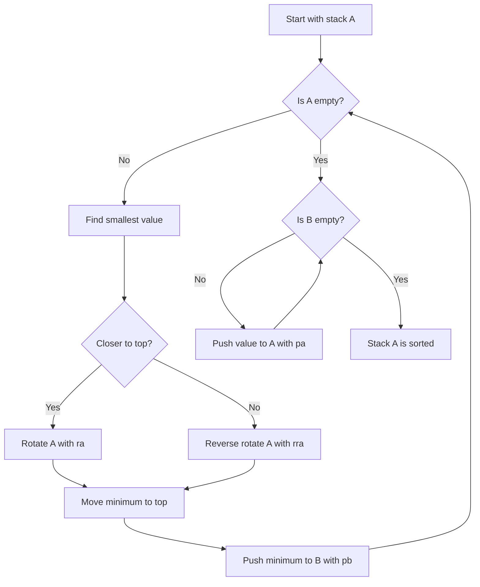
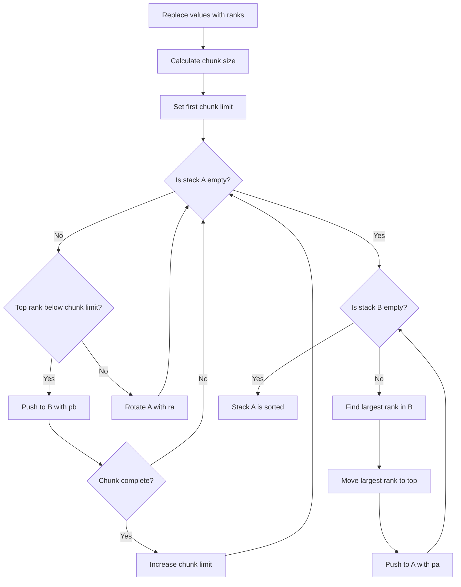
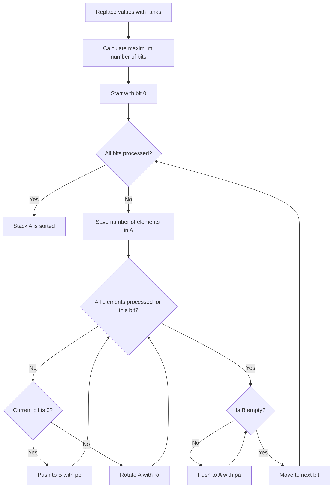
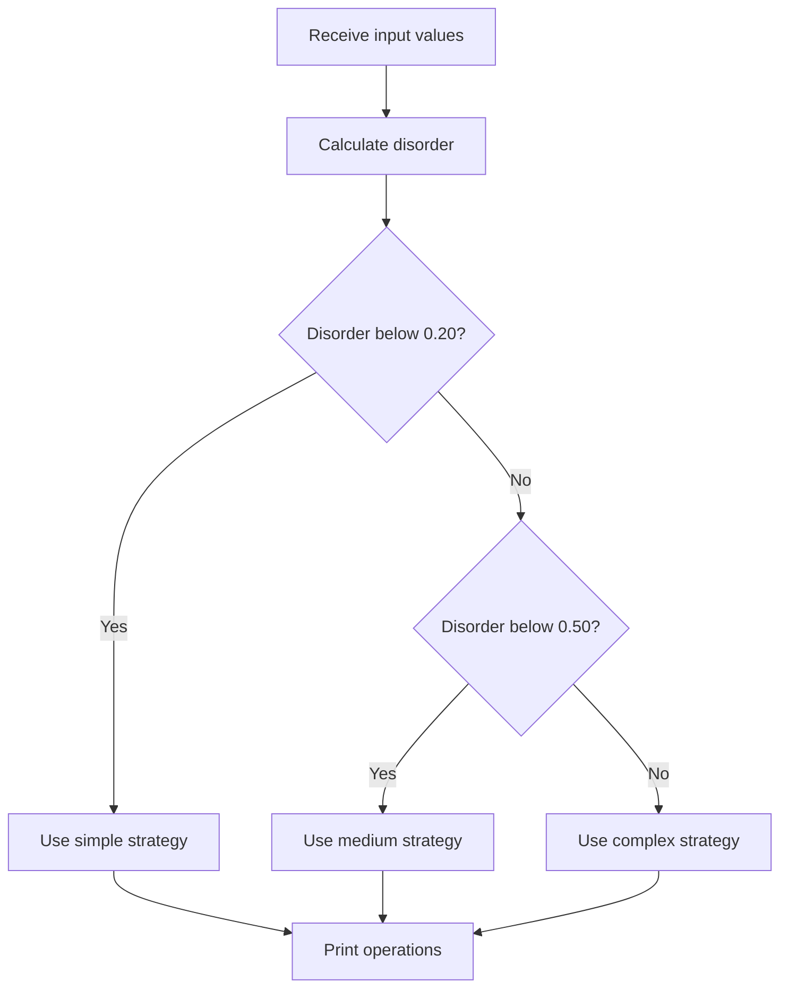
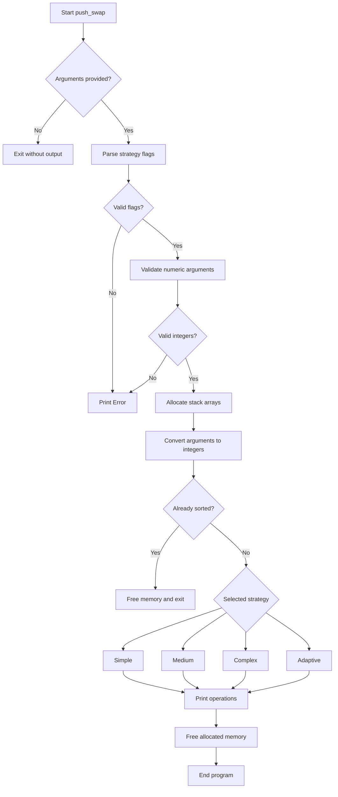

*This project has been created as part of the 42 curriculum by lordamas and jotto.*

# Push Swap - Sorting Data with Limited Stack Operations

## Description

The **Push Swap** project is part of the 42 school curriculum. Its goal is to sort a sequence of integers using two stacks and a restricted set of operations.

The program receives integers as command-line arguments:

```bash
./push_swap 4 2 7 1 3
```

It prints a sequence of stack operations that sorts the values in ascending order.

Example output:

```text
pb
ra
pb
pa
pa
```

The program does not print the sorted array itself. Instead, it prints the instructions required to transform stack A into a sorted stack.

The project focuses on:

* Algorithm design;
* Stack manipulation;
* Input validation;
* Complexity analysis;
* Operation optimization;
* Dynamic memory allocation;
* Sorting strategies;
* Binary representation;
* Rank normalization;
* Collaboration and project organization.

## Project Objective

At the beginning of the program:

```text
Stack A → contains all input values
Stack B → empty
```

At the end:

```text
Stack A → sorted in ascending order
Stack B → empty
```

For example:

```text
Initial stack A:
[40, -5, 20, 8]

Final stack A:
[-5, 8, 20, 40]
```

The objective is not only to sort the values correctly, but also to minimize the number of printed operations.

## Available Operations

The Push Swap instruction set includes the following stack operations:

| Operation | Description                                               |
| :-------- | :-------------------------------------------------------- |
| `sa`      | Swaps the first two elements of stack A.                  |
| `sb`      | Swaps the first two elements of stack B.                  |
| `ss`      | Executes `sa` and `sb` simultaneously.                    |
| `pa`      | Moves the first element of stack B to the top of stack A. |
| `pb`      | Moves the first element of stack A to the top of stack B. |
| `ra`      | Moves the first element of stack A to the bottom.         |
| `rb`      | Moves the first element of stack B to the bottom.         |
| `rr`      | Executes `ra` and `rb` simultaneously.                    |
| `rra`     | Moves the last element of stack A to the top.             |
| `rrb`     | Moves the last element of stack B to the top.             |
| `rrr`     | Executes `rra` and `rrb` simultaneously.                  |

The current sorting strategies mainly use:

```text
pa
pb
ra
rb
rra
rrb
```

## Features

| Feature                   | Description                                                              |
| :------------------------ | :----------------------------------------------------------------------- |
| **Input validation**      | Rejects invalid integers, duplicates and values outside the `int` range. |
| **Multiple strategies**   | Supports simple, medium, complex and adaptive sorting modes.             |
| **Default adaptive mode** | Automatically chooses a strategy according to the disorder level.        |
| **Rank normalization**    | Replaces values internally with ranks from `0` to `n - 1`.               |
| **Array-based stacks**    | Represents stacks A and B using integer arrays and size variables.       |
| **Operation output**      | Prints one valid Push Swap instruction per line.                         |
| **Error handling**        | Prints `Error` for invalid input.                                        |
| **Negative values**       | Correctly handles negative integers.                                     |
| **Complexity comparison** | Makes it possible to compare different sorting approaches.               |
| **Memory management**     | Frees dynamically allocated arrays after execution.                      |

## Strategy Flags

The program supports the following flags:

| Flag         | Strategy                                        |
| :----------- | :---------------------------------------------- |
| `--simple`   | Uses repeated minimum extraction.               |
| `--medium`   | Uses rank-based chunk sorting.                  |
| `--complex`  | Uses binary LSD Radix Sort.                     |
| `--adaptive` | Chooses a strategy based on the disorder level. |
| No flag      | Uses the adaptive strategy by default.          |

Examples:

```bash
./push_swap --simple 4 2 7 1 3
```

```bash
./push_swap --medium 4 2 7 1 3
```

```bash
./push_swap --complex 4 2 7 1 3
```

```bash
./push_swap --adaptive 4 2 7 1 3
```

```bash
./push_swap 4 2 7 1 3
```

## Project Files

```text
Makefile
README.md
push_swap.h
main.c
check_input.c
parse_to_array.c
operations.c
sorting_helpers.c
rank_helpers.c
sort_simple.c
sort_medium.c
sort_complex.c
sort_adaptive.c
```

### File Responsibilities

| File                | Purpose                                                                        |
| :------------------ | :----------------------------------------------------------------------------- |
| `main.c`            | Initializes the program, prepares the arrays and starts the selected strategy. |
| `check_input.c`     | Validates numbers, integer limits and duplicates.                              |
| `parse_to_array.c`  | Parses strategy flags and copies valid numeric arguments.                      |
| `operations.c`      | Implements stack operations and prints their names.                            |
| `sorting_helpers.c` | Contains sorting and value-search helper functions.                            |
| `rank_helpers.c`    | Converts original values into normalized ranks.                                |
| `sort_simple.c`     | Implements the simple sorting strategy.                                        |
| `sort_medium.c`     | Implements the chunk-based strategy.                                           |
| `sort_complex.c`    | Implements binary LSD Radix Sort.                                              |
| `sort_adaptive.c`   | Calculates disorder and selects a sorting strategy.                            |
| `push_swap.h`       | Contains shared declarations, prototypes and structures.                       |
| `Makefile`          | Compiles the project and manages object files.                                 |

## Stack Representation

The project represents stacks using arrays.

For example:

```text
A = [4, 2, 7, 1]
B = []
```

The top of a stack is stored at index `0`:

```text
A[0] = 4
```

Each stack also has a size variable:

```c
int	sizea;
int	sizeb;
```

When executing `pb`:

```text
Before:

A = [4, 2, 7, 1]
B = []

After:

A = [2, 7, 1]
B = [4]
```

The size values are updated:

```text
sizea: 4 → 3
sizeb: 0 → 1
```

## Input Validation

Before sorting, the program verifies that every argument is valid.

The validation includes:

1. Checking that each argument represents a number.
2. Accepting an optional `+` or `-` sign.
3. Rejecting isolated signs.
4. Detecting values larger than `INT_MAX`.
5. Detecting values smaller than `INT_MIN`.
6. Rejecting duplicated values.
7. Rejecting invalid strategy flags.
8. Converting the valid arguments into integers.

Examples of invalid input:

```bash
./push_swap 4 two 7
```

```bash
./push_swap 3 8 3
```

```bash
./push_swap 2147483648
```

```bash
./push_swap -2147483649
```

Expected output:

```text
Error
```

## Rank Normalization

Before running the medium or complex strategies, the values are converted into ranks.

Consider:

```text
Original values:
[40, -5, 20, 8]
```

A sorted copy is created:

```text
[-5, 8, 20, 40]
```

Each value receives its sorted index:

```text
-5 → rank 0
 8 → rank 1
20 → rank 2
40 → rank 3
```

The internal stack becomes:

```text
[3, 0, 2, 1]
```

The original values are replaced inside stack A:

```c
a[i] = rank;
```

The temporary sorted copy is then freed.

### Why Ranks Are Used

Ranks preserve the relative order of the original values.

For example:

```text
40 > 20
```

and their ranks preserve the same relationship:

```text
3 > 2
```

Therefore, operations that sort:

```text
[3, 0, 2, 1]
```

also sort the original sequence:

```text
[40, -5, 20, 8]
```

Rank normalization also simplifies the Radix Sort because every value becomes a non-negative integer between:

```text
0 and n - 1
```

## Sorting Strategies

### Simple Strategy

The simple strategy repeatedly finds the smallest value in stack A.

The minimum value is moved to the top using either:

```text
ra
```

or:

```text
rra
```

The choice depends on whether the value is closer to the top or bottom of the stack.

The value is then pushed to stack B with:

```text
pb
```

When stack A is empty, all values are pushed back with:

```text
pa
```

### Simple Strategy Example

Initial state:

```text
A = [4, 2, 3, 1]
B = []
```

The minimum value is `1`.

Because it is close to the bottom, reverse rotation is used:

```text
rra
```

Result:

```text
A = [1, 4, 2, 3]
```

Then:

```text
pb
```

Result:

```text
A = [4, 2, 3]
B = [1]
```

The process repeats until A is empty.

Finally, all elements return to A.

### Simple Strategy Flowchart



### Simple Strategy Complexity

The simple strategy repeatedly searches for one minimum value.

Its operation growth is approximately:

```text
O(n²)
```

It is easy to understand and performs well for small or nearly sorted inputs.

---

## Medium Strategy

The medium strategy divides the ranked values into chunks.

The number of chunks is based on the square root of the number of elements.

The chunk size is calculated using:

```c
chunk_size = (count + chunks - 1) / chunks;
```

The strategy works in two main phases:

1. Push ranks from A to B chunk by chunk.
2. Return values from B to A from the largest rank to the smallest.

### Chunk Example

For 100 elements:

```text
Number of chunks ≈ √100 = 10
Chunk size ≈ 10
```

The first chunk contains ranks:

```text
0 to 9
```

The second chunk contains:

```text
10 to 19
```

The process continues until every rank has been moved to B.

### Moving Values to B

The algorithm checks the value at the top of A.

When the rank belongs to the active chunk:

```text
pb
```

Otherwise:

```text
ra
```

Example:

```text
Active chunk limit = 4
A = [6, 1, 5, 0, 3, 2, 4]
```

The value `6` does not belong to the current chunk:

```text
ra
```

The value `1` belongs to the chunk:

```text
pb
```

### Returning Values to A

After all elements are in B, the largest value is found.

It is moved to the top using:

```text
rb
```

or:

```text
rrb
```

It is then returned to A using:

```text
pa
```

Because the largest available value is always pushed first, the final stack A becomes sorted in ascending order.

### Medium Strategy Flowchart



### Medium Strategy Performance

The chunk strategy generally produces significantly fewer operations than the simple strategy for medium-sized inputs.

Example result for one array containing 100 elements:

```text
Simple strategy: 1506 operations
Medium strategy:  808 operations
```

The exact result depends on the initial order of the values.

---

## Complex Strategy

The complex strategy uses **Binary LSD Radix Sort**.

LSD means:

```text
Least Significant Digit
```

The algorithm begins with the least significant bit, which is the bit on the right side of the binary number.

For example:

```text
0 = 000
1 = 001
2 = 010
3 = 011
4 = 100
5 = 101
6 = 110
7 = 111
```

The bits are processed in this order:

```text
bit 0 → bit 1 → bit 2
```

### Radix Rule

For each element at the top of A:

```text
Current bit = 0 → pb
Current bit = 1 → ra
```

After every element has been processed for the current bit, all values in B are returned to A using:

```text
pa
```

### Bit Verification

The current bit is obtained with:

```c
(a[0] >> bit) & 1
```

The right shift:

```c
a[0] >> bit
```

moves the desired bit to the final binary position.

The bitwise AND:

```c
& 1
```

isolates that final bit.

The result is always:

```text
0 or 1
```

### Radix Example

Consider:

```text
A = [3, 0, 2, 1]
```

Binary representation:

```text
3 = 11
0 = 00
2 = 10
1 = 01
```

#### First Round — Bit 0

```text
3 → bit 1 → ra
0 → bit 0 → pb
2 → bit 0 → pb
1 → bit 1 → ra
```

After returning B to A:

```text
A = [0, 2, 3, 1]
```

#### Second Round — Bit 1

```text
0 → bit 0 → pb
2 → bit 1 → ra
3 → bit 1 → ra
1 → bit 0 → pb
```

After returning B to A:

```text
A = [0, 1, 2, 3]
```

The stack is sorted.

### Radix Sort Flowchart



### Radix Sort Complexity

For each bit, all `n` elements are processed.

The number of required bits is approximately:

```text
log₂(n)
```

Therefore, the operation complexity is:

```text
O(n log n)
```

The strategy is predictable because the number of operations depends mainly on the number of elements, not on their original order.

Example results:

```text
100 elements  → approximately 1084 operations
500 elements  → approximately 6784 operations
1000 elements → processed using 10 binary rounds
```

---

## Adaptive Strategy

The adaptive strategy calculates how disordered the initial array is.

It then selects a sorting strategy according to the disorder level.

The current strategy selection is:

```text
Low disorder    → simple
Medium disorder → medium
High disorder   → complex
```

The thresholds used by the implementation are:

```text
disorder < 0.20       → simple
disorder < 0.50       → medium
disorder >= 0.50      → complex
```

### Why Use an Adaptive Strategy?

No single algorithm is always the best for every input.

The simple strategy may be efficient for a small or nearly sorted array.

The medium strategy often produces fewer operations for medium-sized arrays.

The complex strategy provides predictable growth for large or highly disordered arrays.

The adaptive mode attempts to choose the most appropriate strategy automatically.

### Adaptive Flowchart



## Main Program Flow



## Instructions

### Compilation

Compile the project with:

```bash
make
```

This creates the executable:

```text
push_swap
```

The project is compiled using:

```text
-Wall -Wextra -Werror
```

### Makefile Rules

| Rule          | Description                                    |
| :------------ | :--------------------------------------------- |
| `make`        | Compiles the project.                          |
| `make all`    | Compiles the project.                          |
| `make clean`  | Removes object files.                          |
| `make fclean` | Removes object files and the executable.       |
| `make re`     | Removes everything and recompiles the project. |

## Usage

### Default Adaptive Strategy

```bash
./push_swap 5 3 8 1 7 2
```

### Simple Strategy

```bash
./push_swap --simple 5 3 8 1 7 2
```

### Medium Strategy

```bash
./push_swap --medium 5 3 8 1 7 2
```

### Complex Strategy

```bash
./push_swap --complex 5 3 8 1 7 2
```

### Explicit Adaptive Strategy

```bash
./push_swap --adaptive 5 3 8 1 7 2
```

### Store Operations in a File

```bash
./push_swap --complex 5 3 8 1 7 2 > operations.txt
```

### Count Operations

```bash
./push_swap --complex 5 3 8 1 7 2 | wc -l
```

## Testing with the Checker

The checker receives the original numbers but does not receive the strategy flag.

Example:

```bash
./push_swap --complex 40 -5 20 8 \
	| ./checker_linux 40 -5 20 8
```

Expected output:

```text
OK
```

Using a shell variable:

```bash
ARG="40 -5 20 8"
./push_swap --complex $ARG | ./checker_linux $ARG
```

For 100 random unique values:

```bash
ARG=$(shuf -i 1-10000 -n 100 | tr '\n' ' ')
./push_swap --complex $ARG | ./checker_linux $ARG
```

To count the generated operations:

```bash
./push_swap --complex $ARG | wc -l
```

The external checker is used only for testing and is not part of the main program.

## Random Testing

Generate 100 unique values:

```bash
ARG=$(shuf -i 1-10000 -n 100 | tr '\n' ' ')
```

Generate 500 unique values:

```bash
ARG=$(shuf -i 1-10000 -n 500 | tr '\n' ' ')
```

Generate 1000 unique values:

```bash
ARG=$(shuf -i 1-10000 -n 1000 | tr '\n' ' ')
```

Confirm the number of generated arguments:

```bash
echo "$ARG" | wc -w
```

Compare the strategies:

```bash
echo "simple:   $(./push_swap --simple $ARG | wc -l)"
echo "medium:   $(./push_swap --medium $ARG | wc -l)"
echo "complex:  $(./push_swap --complex $ARG | wc -l)"
echo "adaptive: $(./push_swap --adaptive $ARG | wc -l)"
```

## Testing

The implementation was tested with:

* Empty input;
* One integer;
* Two integers;
* Already sorted input;
* Reverse-sorted input;
* Random values;
* Negative values;
* Positive values;
* Mixed positive and negative values;
* `INT_MIN`;
* `INT_MAX`;
* Duplicate values;
* Invalid numeric strings;
* Invalid strategy flags;
* Arrays containing 100 values;
* Arrays containing 500 values;
* Arrays containing 1000 values;
* Arrays containing 20k values;
* Different disorder levels;
* Every available sorting strategy;
* The external Push Swap checker.

### Example Performance Results

For one array of 100 unique values:

```text
Simple:   1506 operations
Medium:    808 operations
Complex:  1084 operations
```

For random arrays of 500 values, the observed adaptive results were approximately:

```text
6748 to 8140 operations
```

Operation counts vary according to the strategy and the order of the input values.

## Memory Testing

Valgrind can be used to detect memory leaks and invalid memory access:

```bash
valgrind --leak-check=full --show-leak-kinds=all \
	./push_swap --complex 5 3 8 1 7 2
```

Expected result:

```text
All heap blocks were freed -- no leaks are possible
ERROR SUMMARY: 0 errors
```

## Norminette

The source and header files can be checked with:

```bash
norminette *.c *.h
```

The project follows the 42 coding standard, including:

* Function length limits;
* Parameter limits;
* Variable declaration rules;
* Header formatting;
* Indentation;
* Naming conventions.

## Edge Cases

The implementation handles the following cases:

```text
No arguments                  → no output
One integer                   → no operations
Already sorted input          → no operations
Negative integers             → valid
Positive integers             → valid
INT_MIN                       → valid
INT_MAX                       → valid
Duplicate integers            → Error
Non-numeric arguments         → Error
Values above INT_MAX          → Error
Values below INT_MIN          → Error
Invalid strategy flag         → Error
```

Examples:

```bash
./push_swap
```

```bash
./push_swap 42
```

```bash
./push_swap 1 2 3 4 5
```

```bash
./push_swap 3 3
```

```bash
./push_swap one 2 3
```

```bash
./push_swap 2147483648
```

```bash
./push_swap -2147483649
```

## Resources

### Documentation and References

* **Linux Manual Pages**

  * `man 3 malloc`
  * `man 3 free`
  * `man 2 write`

* **42 Push Swap Subject**

  * Used as the primary reference for project requirements, valid operations, input rules and evaluation criteria.

* **C Programming Documentation**

  * References about pointers, arrays, integer limits, bitwise operators and dynamic allocation.

* **Sorting Algorithm References**

  * Selection-based sorting;
  * Chunk sorting;
  * Radix Sort;
  * LSD and MSD Radix approaches;
  * Binary representation and bitwise operations.

* **Valgrind**

  * Used to detect memory leaks, invalid reads and invalid writes.

* **Norminette**

  * Used to verify compliance with the 42 coding standard.

* **Push Swap Checker**

  * Used to verify that the printed instruction sequence correctly sorts the original input.

### AI Usage Disclosure

Artificial Intelligence, specifically ChatGPT, was used as a learning and review tool during the development of this project.

#### Acknowledgments and Learning

To understand the algorithms and produce a reliable implementation, several external resources were consulted:

* **Manuals and Documentation**: Official documentation and C references were used to understand pointers, arrays, bitwise operations, integer limits and memory allocation.
* **Algorithm Research**: Educational materials were consulted to understand chunk sorting, rank normalization and binary LSD Radix Sort.
* **Conceptual Support**: AI was used as a secondary learning aid to clarify topics such as stack operations, rank replacement, binary shifts, bit masks, algorithm complexity and adaptive strategy selection.
* **Testing Support**: AI helped suggest test cases, random-input commands, checker usage and memory-testing procedures.
* **Documentation and Formatting**: AI was used to organize and review this README, including tables, examples and Mermaid diagrams.
* **Collaborative Development**: The project was developed collaboratively by `lordamas` and `jotto`, with code review, testing and discussion of algorithmic decisions shared between both contributors.

The final implementation, testing decisions and understanding of the code remain the responsibility of the project authors.

---

*Developed collaboratively by lordamas and jotto as part of the 42 school program.*
